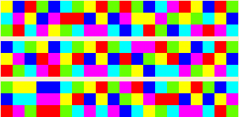
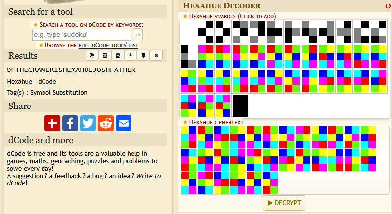

## Background of Event
This was the first in-person CTF challenge I've ever done. While I was tempted to stay the full 24 hours, I unfortunately couldn't. It was quite a fun event, even though I only really solved three challenges. The challenges themselves were ranging in difficulty, and there was a wide spread of challenges. These challenges make you think, and try to find other avenues for solving a problem. Think you've got a solution? Think some more. There were layers to the challenges, which made them engaging and worthwhile to actually stick with. 

I got to the NJIT tennis court, where the competition was being held, and found my new teammates who I'd be working alongside. Once the competition began, I put my headphones on and began listening to music while I worked. I tried three or four different challenges, without really getting anywhere. After about two or three hours of this, I decided I needed to find ***at least one flag*** before I would head home. 

And so began my journey with exploring the bitcoin blockchain.

## Miscellaneous
### Bitcoin Butterfingers
#### Description
A careless RB-affiliated Netrunner fumbled a Bitcoin transaction 11 years ago, leaving a trail across the blockchain. It seems some marshals took hold of our BTC, which originated from only the most legitimate business ventures, of course.

NICC needs you to follow the money—trace the transactions and find the final wallet holding the flag! But be careful—before reaching the destination, the funds passed through another wallet that you'll need to track along the way.

The wallet is `1Ez69SnzzmePmZX3WpEzMKTrcBF2gpNQ55` and the transaction is 29.659K BTC! Hopefully that doesn't equal a lot of USD these days...
 
#### Process
I spent a very long time on this challenge. My initial thinking was to simply trace the 29,000 BTC using the blockchain explorer, until I reached a point where the there was no longer any further transfers of the funds. For a few hours, I worked on this process, by tracking down the transaction and following each new bitcoin address. I constantly reached splitting points, where the funds would split into several different wallets at once with a set quantity of bitcoins per wallet. My thinking was that I had to take note of the previous wallet addresses, and see if one of the wallets led to a recombination of the funds.

After some time of doing this and getting no where, I decided to use a bit of OSINT. Given by the description of this challenge, I figured it was likely the seized wallet address of a dark net market. After some digging on Google, I found a matching report of the seized funds of the dark net market "Silk Road", with the seized fund sum matching the 29,000 bitcoins in the wallet. The final seized address of the seized funds wallet is `1F1...`. After trying that as the flag, as `jctfv{1F1...}`, I got an incorrect flag message. I decided to trace the funds before and afterwards, to see if there were any wallets matching at least 20,000 bitcoin, however after hours, I could not find any leads.

I received a hint from one administrator of JerseyCTF, to "make sure to read the actual description", although it is a bit confusing. After some head-banging, the developer of the challenge came up to me and asked if I was working on his bitcoin challenge. After seeing me suffer quite a bit, he also gave me more advice. The challenge was poorly worded, I didn't need to find the "final" address where most of the funds were left, I needed to look for which hop the bitcoin **no longer summed to ~29,000 bitcoin.**

#### Solution
After about 10 minutes after this advice, I found the solution. About one or two hops away from the transaction from the given address, the sum of the cryptocurrency dropped below 29,000 bitcoin, giving me the flag `jctfv{16cTyJLWbXQz3UZ3sYjy6A6VGX4sAqiEo1}`.

Needless to say, once I found the flag, having spent about ***four hours on this challenge***, I immediately yelled *"YOU'VE GOT TO BE-"* before I controlled myself and just had a sigh of relief. After that, I closed my laptop, hung around for a bit, and then headed home to rest.

-----

## OSINT
### Layers and Layers
#### Description
Looks like Dr. Tom is still using Beef N Cheddar - where The Consortium has been gathering online... They talk pretty openly, and it looks like some looselips may have been too confident in the security Dr. Tom set up. Those blabbermouths even left this finger print laying around `99AB8B9756802E8ACE7F0A7A421A949FEAFF133F`.

NICC suspects it’s part of the network spreading cyber psychosis—trace its location before the infection spreads further!

#### Process
When initially looking into this challenge, there were two thoughts on what the fingerprint might be related to:
1. Some kind of *Tor relay* or fingerprint
2. The fingerprint of a *PGP* key

I followed the first thought to start off with. I searched *Kagi* for search engines for Tor fingerprints. I quickly found the Tor Relay Search page. Upon inputting the fingerprint given in the description, I immediately found a Relay by the name of "JerseyCTFV". This relay was created very recently, and appears to be hosted on Amazon. On this page, there isn't an immediate key or flag, however it does list the **Host Name** of the server.

#### Solution
Upon navigating to the **Host Name** of the server, `ec2-34-232-37-153.compute-1.amazonaws.com`, you'll find a temporary web page. By going into the developer tools, and checking the *Network* tab, you'll find the GET request for the root directory `/`. Inside the headers of this GET request is the **flag**: `X-JCTFV-Flag: jctfv{p33l-th4t-0n10n}`

---

## Cryptography
### Almighty - Alphabet
#### Description
The criminal alphabet, the noir alphabet, the alphabet of a private detective, and whatnot, but there is still something mystical that doesn't look like an alphabet, but at the same time it hides the magical message.

#### Process
At first glance, this seems like a rather strange challenge. I can tell it's some kind of code, but I am unsure if it was made with a particular script, or if I'm supposed to do pattern analysis. My assumption is that this is some kind of substitution cipher, using color patterns for the alphabet. I did a quick *Kagi* search for "cryptography colors to alphabet", and the first link was a Hexahue decoder. 

Upon research, the Hexahue Cipher indeed is a substitution cipher. The letters of the alphabet are replaced by a unique symbol, a 2x3 grid of colored squares. There are 6 possible colors, each only being used once. You could also add black, white, and gray to get numbers as well.

To make the process easier (and because I wanted to get it right the first time), I opened the encoded message in an image editor. The decoder allows you to click each pattern, so I just had to match them up completely. One-by-one, I identified which symbol matched the current symbol in the problem, and once confirmed and chosen, I would cross it off on the encoded message. This process took about 20-30 minutes.

#### Solution
A good way of seeing this problem is like the digital equivalent of *braille*. Just instead of using physical bumps (which wouldn't translate on a phone or computer), you're using a color pattern instead.

The resulting text was `OFTHECRAMERISHEXAHUEJOSHFATHER`. Unfortunately (and rather terrifyingly), when I combined it into the flag format and submitted it, it came up *incorrect*. Fearing that I messed something up, I went back and looked at the color codes. Everything was matching up correctly. 

When I first got the decoded text, I immediately recognized there were individual words in the message. After a bit of thinking, I realized that the developer of the flag might want me to *reorder the words*, to make it an understandable sentence. Hence, the **solution for this flag** is `jctfv{JOSHCRAMERISTHEFATHEROFHEXAHUE}`.

 - *This image shows the input of the encoded message, and the output of the decoded message.*

## Final Notes
All-in-all, this was a fantastic event. Everyone seemed to have a good time. It was nice that even while you're participating in the event, you were free to walk around and chat with some of the volunteers, admins, and developers of the competition. Being able to decompress and chill out with people probably saved my sanity (I took multiple breaks while I was working on the bitcoin challenge).

Next year, I look forward to actually help organize the event, and possibly make some challenges of my own. For those participating next year, if I do make some challenges, it might be a good idea to practice Geoguessr 😉